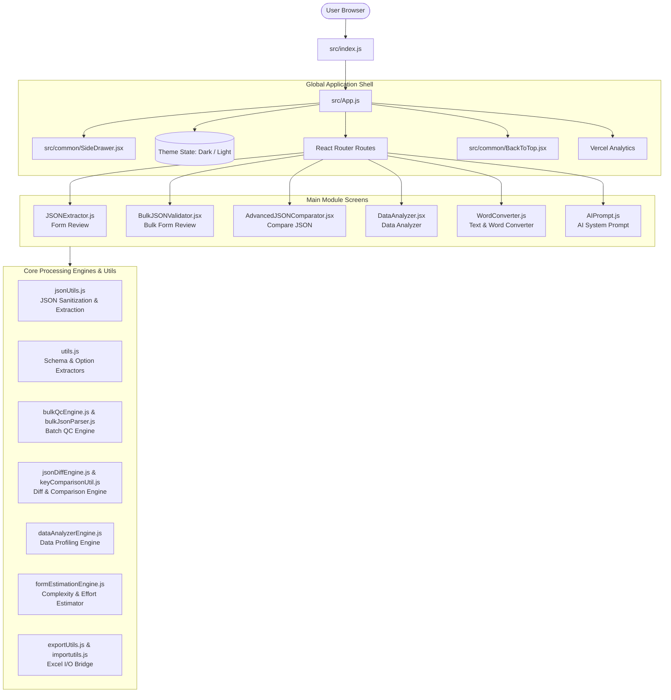
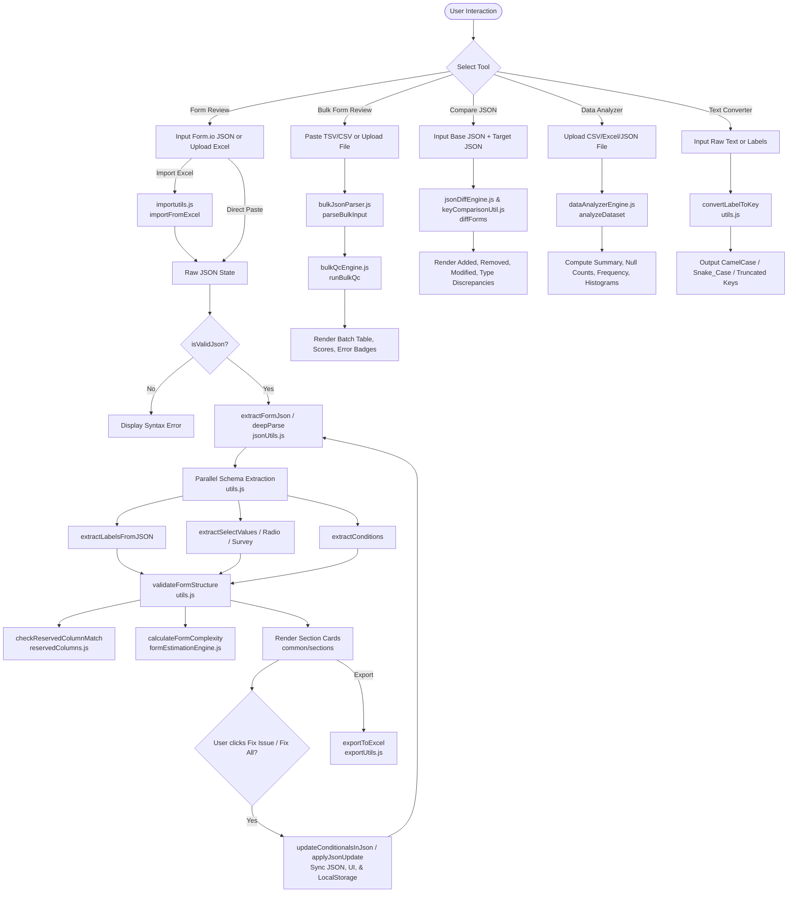
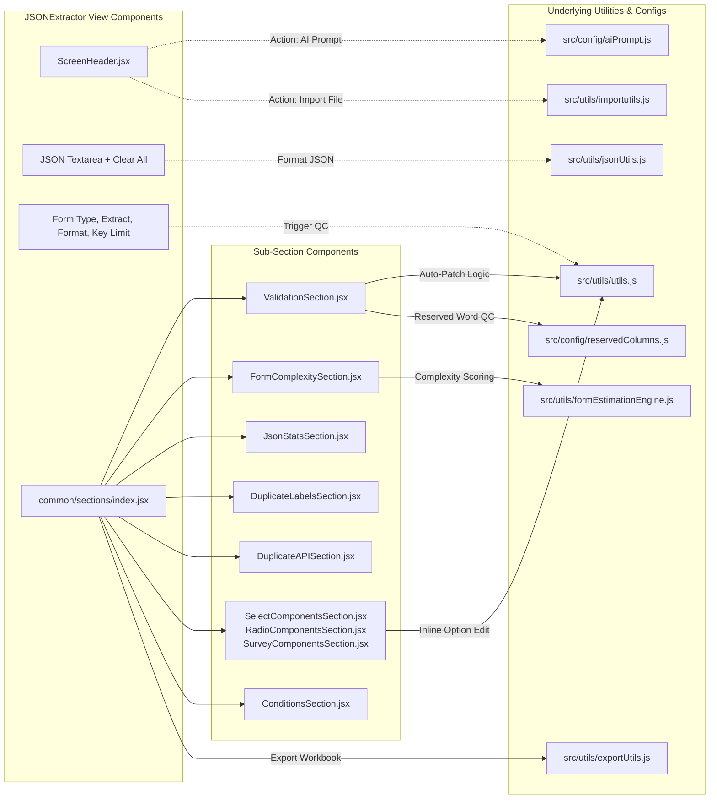
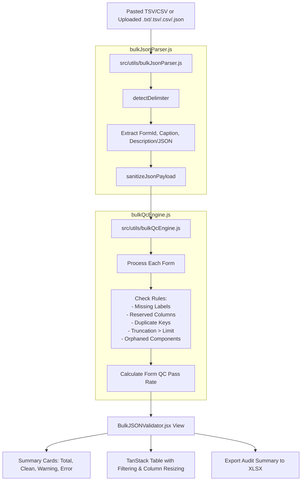
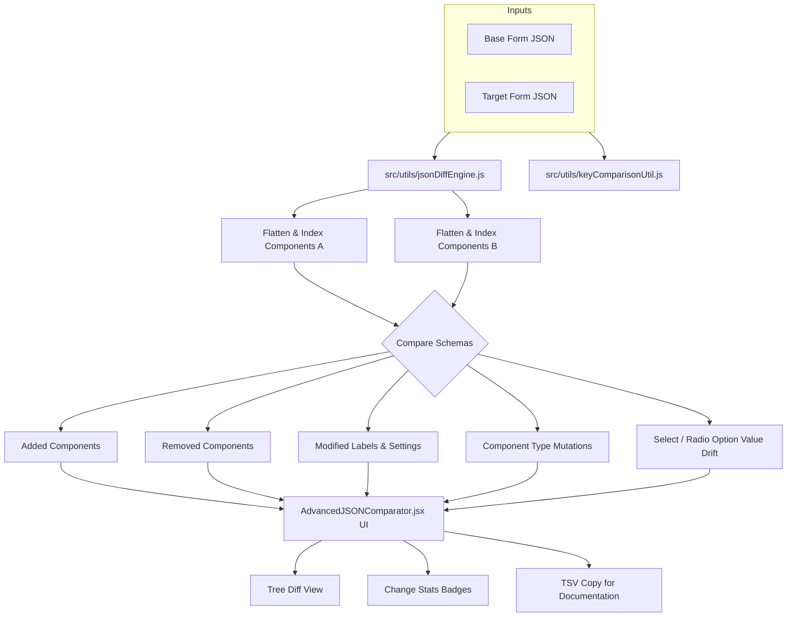
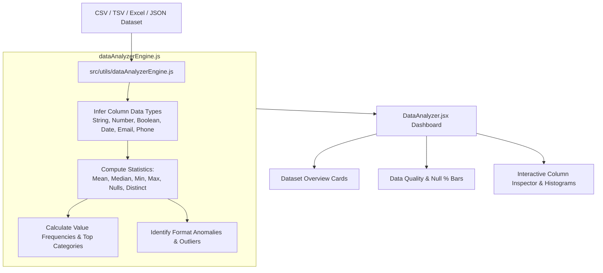
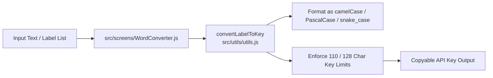
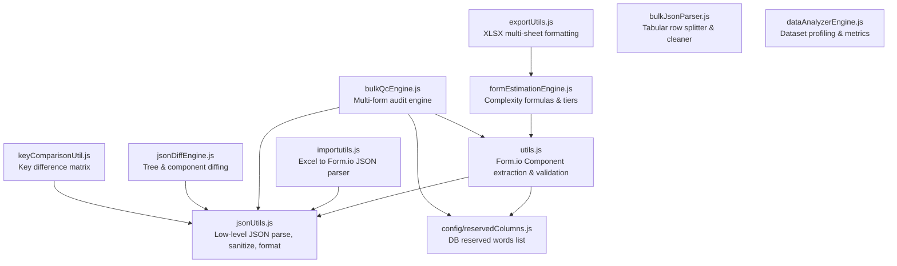

# Form QC Tool (PS-formsqc) - Codebase Architecture & Flowcharts

This document provides a comprehensive technical overview of the **PS-formsqc** application, illustrating how all screens, components, configuration files, and utility engines interact and connect with each other.

---

## Table of Contents
1. [High-Level System Architecture](#1-high-level-system-architecture)
2. [End-to-End System Flowchart](#2-end-to-end-system-flowchart)
3. [Screen-Level Data Flow & Utility Connections](#3-screen-level-data-flow--utility-connections)
   - [3.1 Form Review (JSONExtractor)](#31-form-review-jsonextractor)
   - [3.2 Bulk Form Review (BulkJSONValidator)](#32-bulk-form-review-bulkjsonvalidator)
   - [3.3 Compare JSON (AdvancedJSONComparator)](#33-compare-json-advancedjsoncomparator)
   - [3.4 Data Analyzer (DataAnalyzer)](#34-data-analyzer-dataanalyzer)
   - [3.5 Text & Word Converter (WordConverter)](#35-text--word-converter-wordconverter)
4. [Utility Engine Interdependence Graph](#4-utility-engine-interdependence-graph)
5. [Complete File Directory & Responsibility Matrix](#5-complete-file-directory--responsibility-matrix)

---

## 1. High-Level System Architecture

The application is built on **React 19**, **React Router v7**, **Bootstrap 5 / React-Bootstrap**, and **TanStack Table v8**. It processes complex Form.io JSON schemas and tabular dataset exports to perform Quality Control (QC), schema normalization, structural diffing, complexity estimation, and data profiling.

---

## 2. End-to-End System Flowchart

This flowchart outlines the entire lifecycle: from entering JSON or uploading an Excel file, through parsing, validation, automated remediation (patching), complexity scoring, and export.

---

## 3. Screen-Level Data Flow & Utility Connections

### 3.1 Form Review (`JSONExtractor.js`)
`JSONExtractor.js` is the central screen of the application. It processes single Form.io schemas, detects errors, suggests automated fixes, scores form building complexity, and outputs Excel review books.

#### Key Functional Logic:
- **`jsonUtils.js`**: `extractFormJson` identifies whether the pasted JSON is a raw Form.io component tree or wrapped inside metadata (e.g., API payloads with `config` or `components` wrappers).
- **`utils.js`**:
  - `extractLabelsFromJSON`: Recursively traverses layout containers (`columns`, `panel`, `fieldset`, `well`) and captures nested components, tracking whether fields are inside `datagrid` or `editgrid`.
  - `extractConditions`: Builds dependency graphs where field visibility depends on another component's key.
  - `updateConditionReferencesInJson`: When an API key is fixed, this function patches all conditional logic expressions (`when`, JavaScript calculations) referencing the old key to prevent broken conditional dependencies.
- **`formEstimationEngine.js`**: Evaluates form development complexity (Simple, Medium, Complex, Tier 4) based on weighted formula calculation (grid nesting, custom conditionals, logic handlers, dynamic URLs).

---

### 3.2 Bulk Form Review (`BulkJSONValidator.jsx`)
`BulkJSONValidator.jsx` validates dozens or hundreds of Form.io forms in a single batch, typically generated by database export scripts.

---

### 3.3 Compare JSON (`AdvancedJSONComparator.jsx`)
`AdvancedJSONComparator.jsx` takes two Form.io JSON objects (e.g., Version A vs. Version B) and highlights all schema evolutions.

---

### 3.4 Data Analyzer (`DataAnalyzer.jsx`)
`DataAnalyzer.jsx` profiles raw datasets, inspecting schema integrity, data distribution, and missing value patterns.

---

### 3.5 Text & Word Converter (`WordConverter.js`)
Provides immediate utility helpers for sanitizing and generating compliant database columns and API keys from raw human labels.

---

## 4. Utility Engine Interdependence Graph

This diagram illustrates how utility files depend on or feed data to each other:

---

## 5. Complete File Directory & Responsibility Matrix

| File Path | Layer | Responsibility / Purpose |
| :--- | :--- | :--- |
| **`src/index.js`** | Root Entry | React DOM rendering & bootstrap entry point. |
| **`src/App.js`** | Routing Shell | Houses theme state (dark/light), main layout shell, navigation routes, and Vercel Analytics. |
| **`src/App.css`** | Global Styles | Root background variables, layout styling, and dark theme tooltip enhancements. |
| **`src/common/SideDrawer.jsx`** | Navigation Shell | Collapsible navigation sidebar with route links, icon-only collapsed hover tooltips, and theme toggle. |
| **`src/common/ScreenHeader.jsx`** | Layout UI | Unified header with glowing blue icon badge, title, subtitle, and top-right action slots. |
| **`src/common/BackToTop.jsx`** | Layout UI | Floating smooth scroll-to-top button. |
| **`src/common/sections/`** | UI Widgets | Dedicated modular cards for Form Review results: |
| - `ValidationSection.jsx` | UI Widget | Displays validation issues with auto-fix single/all action buttons. |
| - `FormComplexitySection.jsx` | UI Widget | Visualizes form complexity points, tier badges, and developer hour estimates. |
| - `JsonStatsSection.jsx` | UI Widget | Summary cards for JSON elements, unique keys, and tree depth. |
| - `DuplicateLabelsSection.jsx` | UI Widget | Warns of identical labels that could confuse form respondents. |
| - `DuplicateAPISection.jsx` | UI Widget | Critical warning for duplicate API keys that cause data collisions in Form.io. |
| - `KeyLengthWarningsSection.jsx`| UI Widget | Warns about keys exceeding the designated threshold (e.g., 128 characters). |
| - `SelectComponentsSection.jsx` | UI Widget | Interactive list of select boxes with inline option value editing and auto-key generation. |
| - `RadioComponentsSection.jsx`  | UI Widget | Interactive list of radio groups with inline value editing. |
| - `SurveyComponentsSection.jsx` | UI Widget | Survey question/value inspection and discrepancy alerts. |
| - `ConditionsSection.jsx`       | UI Widget | Visual map of conditional visibility rules (`when` triggers). |
| **`src/screens/JSONExtractor.js`** | Screen | Main screen for Form Review, single form analysis, auto-remediation, and Excel generation. |
| **`src/screens/BulkJSONValidator.jsx`** | Screen | Bulk QC validator for database query outputs (hundreds of forms at once). |
| **`src/screens/AdvancedJSONComparator.jsx`** | Screen | Structural diff engine comparing Base vs. Target Form.io JSONs. |
| **`src/screens/DataAnalyzer.jsx`** | Screen | Dataset profiler for CSV, TSV, and JSON datasets with summary statistics and anomaly detection. |
| **`src/screens/WordConverter.js`** | Screen | Converts user labels into sanitized API keys with various casing transformations. |
| **`src/screens/AIPrompt.js`** | Screen | Interactive reference copy modal for Excel AI generation system prompts. |
| **`src/utils/jsonUtils.js`** | Core Engine | JSON syntax validation, extraction from API wrappers, deep parsing, and formatting. |
| **`src/utils/utils.js`** | Core Engine | Schema element traversal, option extractions, conditional reference patching, and QC rules. |
| **`src/utils/bulkJsonParser.js`** | Core Engine | Delimiter detection and parsing for multi-row database dumps. |
| **`src/utils/bulkQcEngine.js`** | Core Engine | Multi-form QC batch runner checking reserved words, duplicates, and key limits. |
| **`src/utils/jsonDiffEngine.js`** | Core Engine | Recursive tree diffing detecting added, removed, changed components and option drift. |
| **`src/utils/keyComparisonUtil.js`** | Core Engine | Key audit list comparison between two forms. |
| **`src/utils/dataAnalyzerEngine.js`** | Core Engine | Statistical calculation, type inference, and distribution profiling for datasets. |
| **`src/utils/formEstimationEngine.js`** | Core Engine | Form development effort estimation algorithms and tier classifications. |
| **`src/utils/importutils.js`** | Bridge | Parses uploaded Excel spreadsheets and converts rows back into Form.io JSON structures. |
| **`src/utils/exportUtils.js`** | Bridge | Exports analyzed schema tables and metrics into styled multi-tab Excel files. |
| **`src/config/reservedColumns.js`** | Config | Database reserved keywords (SQL, Oracle, Postgres) that cannot be used as API keys. |
| **`src/config/componentTemplates.js`** | Config | Form.io component definitions and default configurations. |
| **`src/config/aiPrompt.js`** | Config | Master prompt template for external LLMs to convert forms to structured tables. |
